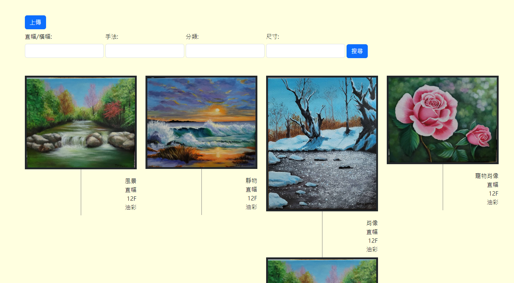

# 線上畫廊

歡迎來到我的線上畫廊專案！這是我第一次開發含有 PHP CRUD 後端管理系統的專案。前端使用了 HTML、CSS 和 Bootstrap 5，後端則是使用 PHP 和 MySQL。

## 前端

1. HTML
2. CSS
3. Bootstrap 5

## 後端

1. PHP
2. MySQL

## 網頁畫面

## 功能

- **圖片上傳:** 使用者可以上傳圖片到畫廊。
- **資料庫搜尋:** 提供搜尋欄位功能，可以顯示不同種類的作品。

